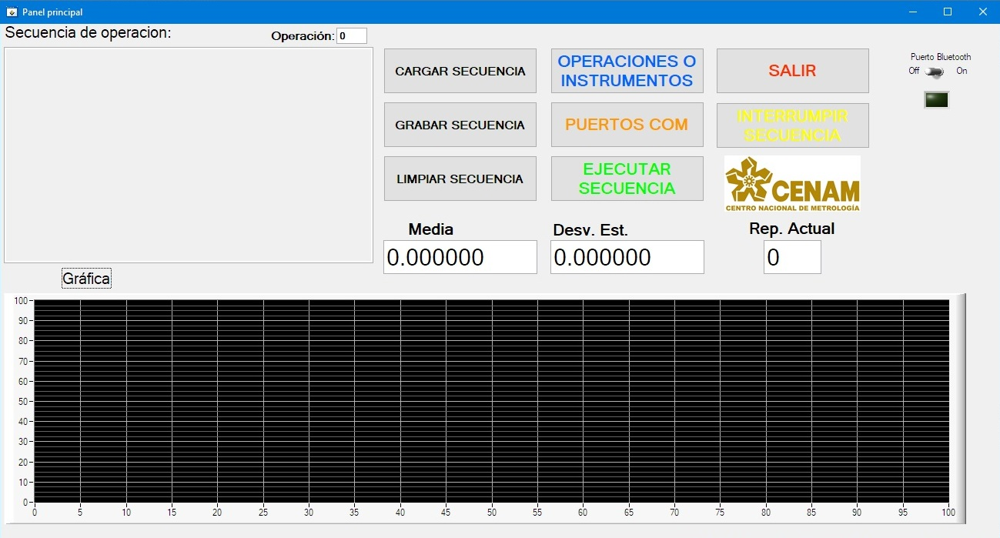
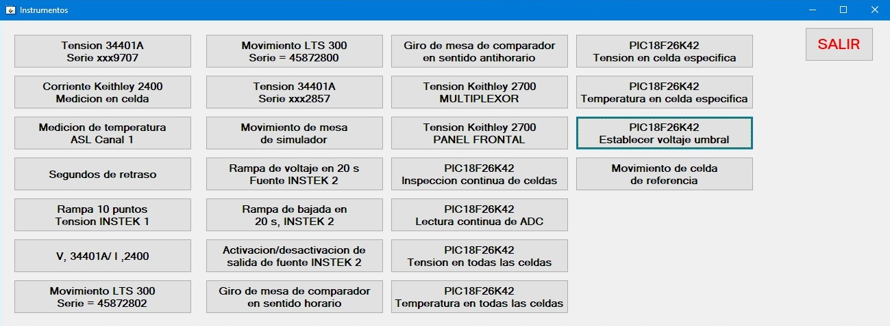
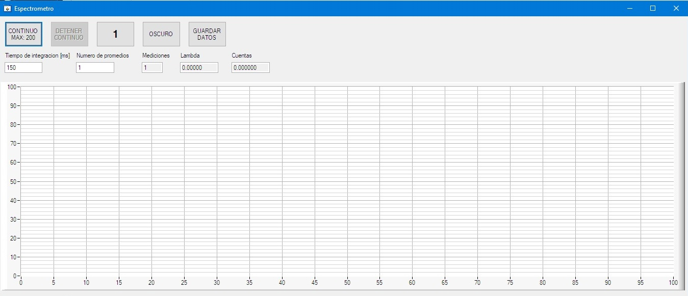

# SolarSimulator
Source code is property of Centro Nacional de Metrologia (CENAM), and I do not have permission to reproduce here.

This project is the first I worked on in CENAM. It's a user interface developed in LabWindows/CVI to control several laboratory equipment in a solar simulator.

The way this software works is by creating measurement sequences, the user selects the instrument it wants to operate, inputs additional parameters (output voltage, number of measurements, distance to move), and the software adds the desired operation to a queue. Once the user presses the EXECUTE button, the queue copies itself and starts processing until it's empty. The copy is neccessary in case the user needs to execute the same queue more than once.

When the user executes the software, the main screen appears.

From here, the user has various options:

* Load a predefined sequence with the CARGAR SECUENCIA button.
* Select the COM port for the instruments to use.
* Exit the software
* Manually open the Bluetooth port to check communication with a microcontroller (this functionality is used for debugging)
* Start creating a new sequence of operations with the OPERACIONES E INSTRUMENTOS button

If the user selects this last option, the OPERACIONES E INSTRUMENTOS screen appears:

From here, the user can freely select which instrument to add to the queue. It is responsibility of the user to add to the queue only the instruments it's going to use, because if the user selects an instrument that's not connected, the program will throw an error when execution begins and tries to connect. In most of the instruments, an additional parameters needs to be input via a popup message.

Every time an operation is successfully created, a text message will be added in the left text box, to aid the user in knowing what the final sequence looks like.

Once the user finishes adding instruments and operations, it can save the sequence to memory with the GRABAR SECUENCIA button, reset the sequence with the LIMPIAR SECUENCIA button, or execute the sequence with the EJECUTAR SECUENCIA button.

If the user decides to execute the sequence, the program asks the user the number of times it wants to execute the same sequence, once it inputs a number, the text box on the left becomes blank, and every time a new element of the queue starts processing, it fills it with the necessary information. The graph on the lower part outputs measurement data from multimeters, and calculates mean and standard deviation.

The Rep. Actual indicator shows the current repetition it is on, and the Operación indicator above the text box displays the current number of the operation in the sequence.

When the execution(s) completes, a log file is updated with the new operations, and a text file with the measurements is created. The user can delete the sequence, execute it again, or exit the software.

An additional instrument not yet included in this software is the control and use of a spectrometer. Currently, it has it's own .exe file that shows the following interface:

Here, the user can change the integration time and the number of averages. Then it can press the CONTINUOUS measurement button, or the SINGLE (1) measurement button. In continuous mode, every time the instrument finishes scanning its spectrum, it outputs the data to the graph, in SINGLE mode, it does this only once.

The OSCURO button must be pressed only when the spectrometer probe is covered, it takes a single measurement and saves it; whenever a new measurement occurs, it's going to substract this dark signal to the measured signal.

In CONTINUOUS mode, every measurement is saved in the program memory, and when the user presses the GUARDAR DATOS button, it gets copied to computer memory, but in single mode, only the latest measurement can be saved to memory.
